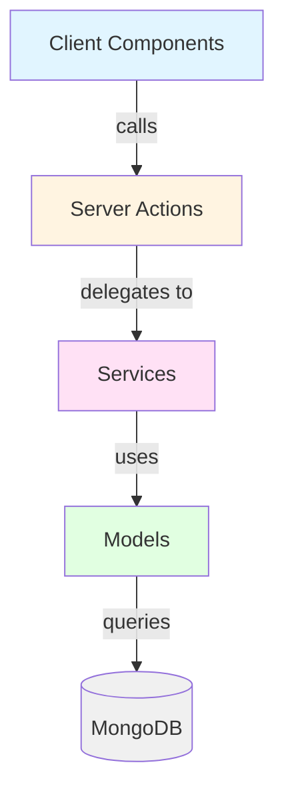
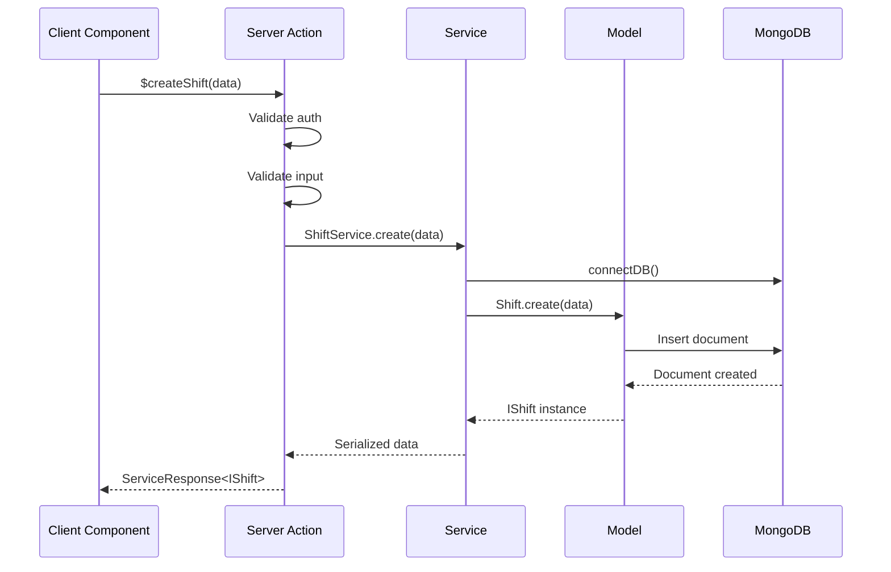
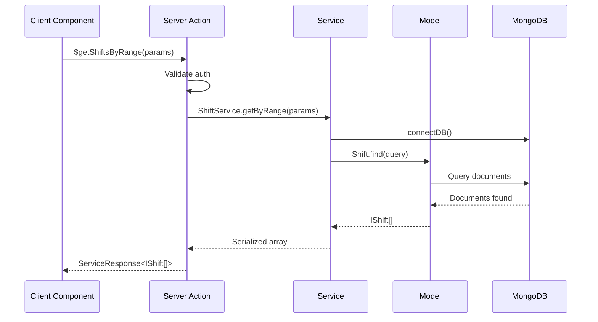

# Shiftly Architecture

This document describes the architectural patterns, design decisions, and code organization for the Shiftly platform.

## Table of Contents

- [Overview](#overview)
- [3-Layer Architecture](#3-layer-architecture)
- [Directory Structure](#directory-structure)
- [Naming Conventions](#naming-conventions)
- [Data Flow](#data-flow)
- [Authentication & Authorization](#authentication--authorization)
- [Error Handling](#error-handling)
- [Type System](#type-system)

## Overview

Shiftly follows a **3-layer architecture** pattern that separates concerns between presentation, business logic, and data access. This architecture ensures:

- **Maintainability**: Clear separation of concerns
- **Testability**: Each layer can be tested independently
- **Scalability**: Easy to extend and modify
- **Type Safety**: Full TypeScript support throughout

## 3-Layer Architecture

The application is organized into three distinct layers:



### Layer 1: Server Actions

**Location**: `actions/`

Server actions are the entry points for client-server communication. They:

- Handle authentication and authorization
- Validate input data using Zod schemas
- Delegate business logic to services
- Return standardized responses

**Pattern**:

```typescript
"use server";
import { ServiceName } from "@/server/services/ServiceName";
import { $getAccountFromSession } from "../account/account";
import { AppError } from "@/utils/appError";

export async function $actionName(params: ParamsType) {
  const account = await $getAccountFromSession();
  if (account instanceof AppError || !account)
    return new AppError("Unauthorized");

  return await ServiceName.methodName(params);
}
```

**Naming Convention**: CamelCase with `$` prefix (e.g., `$getShiftsByRange`)

### Layer 2: Services

**Location**: `server/services/`

Services contain all business logic and data manipulation. They:

- Connect to the database
- Perform CRUD operations
- Handle complex business rules
- Return serialized data or errors

**Pattern**:

```typescript
import { connectDB } from "@/server/db/connect";
import Model from "@/server/models/Model";
import { AppError } from "@/utils/appError";
import { ServiceResponse } from "@/types";

const methodName = async (
  params: ParamsType,
): Promise<ServiceResponse<ReturnType>> => {
  await connectDB();
  try {
    const data = await Model.find(params);
    return JSON.parse(JSON.stringify(data));
  } catch (error) {
    console.error("Error:", error);
    return new AppError("Failed to fetch data");
  }
};

export const ServiceName = { methodName };
```

**Key Points**:

- Always call `await connectDB()` at the start
- Use `JSON.parse(JSON.stringify(data))` for serialization
- Return `AppError` instances on failure
- Return type is always `Promise<ServiceResponse<T>>`

**Naming Convention**: PascalCase (e.g., `ShiftService`, `EmployeeService`)

### Layer 3: Models

**Location**: `server/models/`

Models define the data schema and database structure using Mongoose. They:

- Define TypeScript interfaces extending `Document`
- Define Mongoose schemas with validation
- Export models with hot-reload protection

**Pattern**:

```typescript
import mongoose, { Schema, Document, Model } from "mongoose";

export interface IModelName extends Document {
  field: string;
  createdAt: Date;
  updatedAt: Date;
}

const ModelSchema: Schema<IModelName> = new Schema(
  {
    field: { type: String, required: true },
  },
  { timestamps: true },
);

const ModelName: Model<IModelName> =
  mongoose.models.ModelName ||
  mongoose.model<IModelName>("ModelName", ModelSchema);

export default ModelName;
```

**Naming Convention**: PascalCase (e.g., `Shift`, `Employee`, `Account`)

## Directory Structure

```
shiftly/
├── actions/              # Server Actions (Layer 1)
│   ├── account/
│   ├── shifts/
│   ├── employees/
│   ├── events/
│   └── ...
├── server/
│   ├── models/          # Mongoose Models (Layer 3)
│   ├── services/        # Business Logic (Layer 2)
│   └── db/              # Database connection
├── components/          # React Components
│   ├── ui/              # Generic UI components
│   ├── shifts/          # Shift-specific components
│   ├── events/          # Event-specific components
│   └── ...
├── app/                 # Next.js App Router
│   └── (main)/          # Main application routes
├── types/               # TypeScript type definitions
├── utils/               # Shared utilities
├── hooks/               # Custom React hooks
├── lib/                 # Third-party library configs
└── public/              # Static assets
```

## Naming Conventions

### Files and Directories

| Type           | Convention                        | Example             |
| -------------- | --------------------------------- | ------------------- |
| Server Actions | `$camelCase`                      | `$getShiftsByRange` |
| Services       | `PascalCase.ts`                   | `ShiftService`      |
| Models         | `PascalCase.ts`                   | `Shift.ts`          |
| Components     | `PascalCase.tsx`                  | `ShiftCalendar.tsx` |
| Utilities      | `camelCase.ts`                    | `appError.ts`       |
| Types          | `camelCase.ts` or `PascalCase.ts` | `schedule.ts`       |

### Code Elements

| Type                | Convention         | Example                             |
| ------------------- | ------------------ | ----------------------------------- |
| Interfaces (Models) | `I` + `PascalCase` | `IShift`, `IAccount`                |
| Types               | `PascalCase`       | `ServiceResponse`, `ActionResponse` |
| Constants           | `UPPER_SNAKE_CASE` | `MAX_SHIFTS_PER_DAY`                |
| Functions           | `camelCase`        | `createShift`, `validateInput`      |

## Data Flow

### Creating a Resource



### Reading Resources



## Authentication & Authorization

### Session Management

Authentication is handled using JWT tokens stored in HTTP-only cookies:

```typescript
import { $getAccountFromSession } from "@/actions/account/account";

const account = await $getAccountFromSession();
if (account instanceof AppError || !account) {
  return new AppError("Unauthorized");
}
```

### Role-Based Access

The system supports two primary roles:

- **Company**: Can manage employees, shifts, and events
- **Employee**: Can view assigned shifts and update availability

Role checking pattern:

```typescript
if (account.role !== "company") {
  return new AppError("Insufficient permissions");
}
```

### Company-Scoped Data

All resources are scoped to companies to ensure data isolation:

```typescript
const shifts = await Shift.find({ company: account._id });
```

## Error Handling

### AppError Class

All errors use the `AppError` class from `@/utils/appError`:

```typescript
export class AppError extends Error {
  constructor(
    message: string,
    public options?: {
      errorCode?: string;
      statusCode?: number;
    },
  ) {
    super(message);
    this.name = "AppError";
  }
}
```

### Error Handling Pattern

**In Services**:

```typescript
try {
  const result = await Model.operation();
  return JSON.parse(JSON.stringify(result));
} catch (error) {
  console.error("Error:", error);
  return new AppError("Operation failed");
}
```

**In Server Actions**:

```typescript
const result = await Service.method();
if (result instanceof AppError) {
  return result;
}
return result;
```

**In Components**:

```typescript
const result = await $serverAction();
if (result instanceof AppError) {
  toast.error(result.message);
  return;
}
```

## Type System

### ServiceResponse

The `ServiceResponse` type is used for all async operations:

```typescript
export type ServiceResponse<T = unknown, E = AppError> = T | E;
```

This allows functions to return either the expected data or an error:

```typescript
const result: ServiceResponse<IShift[]> = await ShiftService.getAll();
```

### ActionResponse

For form submissions and mutations:

```typescript
export type ActionResponse<T = unknown> = {
  error?: string;
  success?: string;
  data?: T;
  fieldErrors?: Record<string, string[]>;
};
```

### Type Inference

TypeScript is used extensively for type safety:

```typescript
interface IShift extends Document {
  date: Date;
  startTime: string;
  employee?: mongoose.Types.ObjectId;
}
```

## Best Practices

### DO

✅ Always use the 3-layer architecture
✅ Follow naming conventions strictly
✅ Use TypeScript interfaces for all data structures
✅ Serialize data before returning from services
✅ Check authentication in all server actions
✅ Use `AppError` for error handling
✅ Add indexes to frequently queried fields
✅ Use `timestamps: true` in all schemas

### DON'T

❌ Put business logic in server actions
❌ Access models directly from server actions
❌ Return Mongoose documents without serialization
❌ Use `any` type (use `ANY` from types if absolutely necessary)
❌ Add comments in code (code should be self-documenting)
❌ Skip authentication checks
❌ Forget to call `connectDB()` in services

## Technology Stack

- **Framework**: Next.js 16 (App Router)
- **Runtime**: React 19
- **Language**: TypeScript 5
- **Database**: MongoDB with Mongoose
- **Authentication**: JWT with HTTP-only cookies
- **Styling**: Tailwind CSS 4
- **UI Components**: Radix UI primitives
- **Forms**: React Hook Form with Zod validation
- **State Management**: Zustand
- **Real-time**: PubNub
- **Email**: Plunk
- **Package Manager**: Bun
