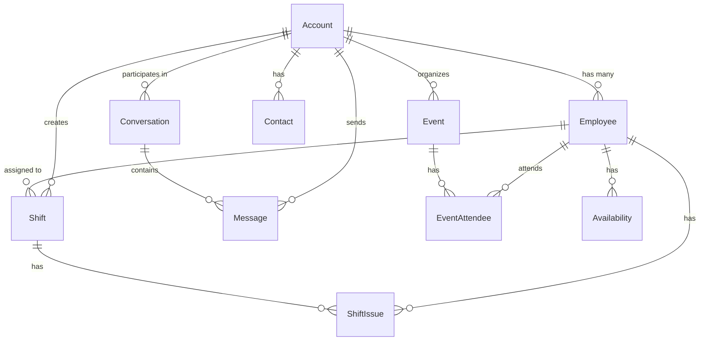

# Database Schema & Models

This document provides comprehensive documentation for all database models in the Shiftly platform.

## Table of Contents

- [Overview](#overview)
- [Database Connection](#database-connection)
- [Models](#models)
  - [Account](#account)
  - [Employee](#employee)
  - [Shift](#shift)
  - [Event](#event)
  - [EventAttendee](#eventattendee)
  - [Availability](#availability)
  - [Contact](#contact)
  - [Conversation](#conversation)
  - [Message](#message)
  - [Invitation](#invitation)
  - [ShiftIssue](#shiftissue)
- [Relationships](#relationships)
- [Indexes](#indexes)

## Overview

Shiftly uses **MongoDB** as its database with **Mongoose** as the ODM (Object Document Mapper). All models follow a consistent pattern:

- TypeScript interface extending `Document`
- Mongoose schema with validation
- Timestamps enabled (`createdAt`, `updatedAt`)
- Hot-reload protection for Next.js development

## Database Connection

**Location**: `server/db/connect.ts`

The database connection is managed through a singleton pattern:

```typescript
import { connectDB } from "@/server/db/connect";

await connectDB();
```

**Environment Variable**: `MONGODB_URI`

## Models

### Account

**File**: `server/models/Account.ts`

Represents user accounts for both companies and employees.

#### Schema

| Field                   | Type     | Required | Description                                |
| ----------------------- | -------- | -------- | ------------------------------------------ |
| `fullname`              | String   | ✅       | User's full name                           |
| `email`                 | String   | ✅       | Unique email address                       |
| `phone`                 | String   | ❌       | Phone number                               |
| `password`              | String   | ✅       | Hashed password (select: false)            |
| `role`                  | Enum     | ✅       | `"company"` or `"employee"`                |
| `avatar`                | String   | ❌       | Avatar URL                                 |
| `companyName`           | String   | ❌       | Company name (for company role)            |
| `companyAddress`        | String   | ❌       | Company address                            |
| `companyTotalEmployees` | String   | ❌       | Total employees count                      |
| `companyNiche`          | String   | ❌       | Company industry/niche                     |
| `companyGoals`          | String[] | ❌       | Company goals                              |
| `status`                | Enum     | ✅       | `"active"`, `"inactive"`, or `"suspended"` |
| `hasOnboarded`          | Boolean  | ✅       | Onboarding completion status               |

#### Interface

```typescript
export interface IAccount extends Document {
  fullname: string;
  email: string;
  phone?: string;
  password?: string;
  role: "company" | "employee";
  avatar?: string;
  companyName?: string;
  companyAddress?: string;
  companyTotalEmployees?: string;
  companyNiche?: string;
  companyGoals?: string[];
  status: "active" | "inactive" | "suspended";
  hasOnboarded: boolean;
  createdAt: Date;
  updatedAt: Date;
}
```

#### Validation

- Email must be valid format and unique
- Password minimum 6 characters
- Password field excluded from queries by default

---

### Employee

**File**: `server/models/Employee.ts`

Represents the relationship between an account and a company.

#### Schema

| Field        | Type     | Required | Description                                           |
| ------------ | -------- | -------- | ----------------------------------------------------- |
| `account`    | ObjectId | ❌       | Reference to Account (null if invited)                |
| `company`    | ObjectId | ✅       | Reference to company Account                          |
| `dummyEmail` | String   | ✅       | Email for invited employees                           |
| `dummyName`  | String   | ✅       | Name for invited employees                            |
| `jobTitle`   | String   | ❌       | Employee's job title                                  |
| `hourlyRate` | Number   | ❌       | Hourly rate (default: 0)                              |
| `status`     | Enum     | ✅       | `"active"`, `"inactive"`, `"invited"`, or `"deleted"` |
| `isAdmin`    | Boolean  | ✅       | Can manage employees/shifts (default: false)          |

#### Interface

```typescript
export interface IEmployee extends Document {
  account: mongoose.Types.ObjectId;
  company: mongoose.Types.ObjectId;
  dummyEmail: string;
  dummyName: string;
  jobTitle?: string;
  hourlyRate?: number;
  status: "active" | "inactive" | "invited" | "deleted";
  isAdmin: boolean;
  createdAt: Date;
  updatedAt: Date;
}
```

#### Indexes

- Compound unique index on `account` + `company` (partial, only when account exists)
- Index on `company` + `status`

---

### Shift

**File**: `server/models/Shift.ts`

Represents scheduled work shifts.

#### Schema

| Field        | Type     | Required | Description                            |
| ------------ | -------- | -------- | -------------------------------------- |
| `date`       | Date     | ✅       | Shift date                             |
| `startTime`  | String   | ✅       | Start time (e.g., "09:00")             |
| `endTime`    | String   | ✅       | End time (e.g., "17:00")               |
| `position`   | String   | ✅       | Job position                           |
| `location`   | String   | ❌       | Work location                          |
| `break`      | String   | ❌       | Break duration                         |
| `details`    | String   | ❌       | Additional details                     |
| `hourlyRate` | Number   | ✅       | Hourly rate (default: 0)               |
| `totalPay`   | Number   | ✅       | Total pay (default: 0)                 |
| `duration`   | String   | ✅       | Shift duration                         |
| `status`     | Enum     | ✅       | `"assigned"` or `"unassigned"`         |
| `repeat`     | String   | ❌       | Repeat pattern (default: "Never")      |
| `employee`   | ObjectId | ❌       | Reference to assigned employee Account |
| `company`    | ObjectId | ✅       | Reference to company Account           |
| `groupId`    | String   | ❌       | Group ID for recurring shifts          |

#### Interface

```typescript
export interface IShift extends Document {
  date: Date;
  startTime: string;
  endTime: string;
  position: string;
  location?: string;
  break?: string;
  details?: string;
  hourlyRate: number;
  totalPay: number;
  duration: string;
  status: "assigned" | "unassigned";
  repeat?: string;
  employee?: mongoose.Types.ObjectId;
  company: mongoose.Types.ObjectId;
  groupId?: string;
  createdAt: Date;
  updatedAt: Date;
}
```

#### Indexes

- Index on `company` + `date`
- Index on `employee` + `date`

---

### Event

**File**: `server/models/Event.ts`

Represents company events.

#### Schema

| Field         | Type     | Required | Description                    |
| ------------- | -------- | -------- | ------------------------------ |
| `title`       | String   | ✅       | Event title                    |
| `description` | String   | ❌       | Event description              |
| `duration`    | String   | ❌       | Event duration                 |
| `date`        | Date     | ✅       | Event date                     |
| `startTime`   | String   | ❌       | Start time                     |
| `endTime`     | String   | ❌       | End time                       |
| `timezone`    | String   | ❌       | Timezone                       |
| `locationUrl` | String   | ❌       | Virtual location URL           |
| `location`    | String   | ❌       | Physical location              |
| `company`     | ObjectId | ✅       | Reference to company Account   |
| `status`      | Enum     | ✅       | `"scheduled"` or `"cancelled"` |

#### Interface

```typescript
export interface IEvent extends Document {
  title: string;
  description: string;
  duration?: string;
  date: Date;
  startTime?: string;
  endTime?: string;
  timezone?: string;
  locationUrl?: string;
  location?: string;
  company: mongoose.Types.ObjectId;
  status: "scheduled" | "cancelled";
  createdAt: Date;
  updatedAt: Date;
}
```

#### Indexes

- Index on `company` + `date`

---

### EventAttendee

**File**: `server/models/EventAttendee.ts`

Tracks event attendance.

#### Schema

| Field         | Type     | Required | Description                                           |
| ------------- | -------- | -------- | ----------------------------------------------------- |
| `event`       | ObjectId | ✅       | Reference to Event                                    |
| `employee`    | ObjectId | ✅       | Reference to Employee                                 |
| `status`      | Enum     | ✅       | `"invited"`, `"accepted"`, `"declined"`, or `"maybe"` |
| `respondedAt` | Date     | ❌       | Response timestamp                                    |

#### Interface

```typescript
export interface IEventAttendee extends Document {
  event: mongoose.Types.ObjectId;
  employee: mongoose.Types.ObjectId;
  status: "invited" | "accepted" | "declined" | "maybe";
  respondedAt?: Date;
  createdAt: Date;
  updatedAt: Date;
}
```

---

### Availability

**File**: `server/models/Availability.ts`

Stores employee weekly availability.

#### Schema

| Field         | Type     | Required | Description               |
| ------------- | -------- | -------- | ------------------------- |
| `employee`    | ObjectId | ✅       | Reference to Employee     |
| `weeklySlots` | Object   | ✅       | Weekly availability slots |

#### Interface

```typescript
export interface IAvailability extends Document {
  employee: mongoose.Types.ObjectId;
  weeklySlots: Record<string, boolean>;
  createdAt: Date;
  updatedAt: Date;
}
```

---

### Contact

**File**: `server/models/Contact.ts`

Manages contact relationships between companies and employees.

#### Schema

| Field      | Type     | Required | Description                   |
| ---------- | -------- | -------- | ----------------------------- |
| `company`  | ObjectId | ✅       | Reference to company Account  |
| `employee` | ObjectId | ✅       | Reference to employee Account |
| `status`   | Enum     | ✅       | `"active"` or `"blocked"`     |

#### Interface

```typescript
export interface IContact extends Document {
  company: mongoose.Types.ObjectId;
  employee: mongoose.Types.ObjectId;
  status: "active" | "blocked";
  createdAt: Date;
  updatedAt: Date;
}
```

---

### Conversation

**File**: `server/models/Conversation.ts`

Represents messaging conversations.

#### Schema

| Field           | Type       | Required | Description                      |
| --------------- | ---------- | -------- | -------------------------------- |
| `participants`  | ObjectId[] | ✅       | Array of participant Account IDs |
| `lastMessage`   | String     | ❌       | Last message content             |
| `lastMessageAt` | Date       | ❌       | Last message timestamp           |

#### Interface

```typescript
export interface IConversation extends Document {
  participants: mongoose.Types.ObjectId[];
  lastMessage?: string;
  lastMessageAt?: Date;
  createdAt: Date;
  updatedAt: Date;
}
```

---

### Message

**File**: `server/models/Message.ts`

Stores individual messages.

#### Schema

| Field          | Type     | Required | Description                  |
| -------------- | -------- | -------- | ---------------------------- |
| `conversation` | ObjectId | ✅       | Reference to Conversation    |
| `sender`       | ObjectId | ✅       | Reference to sender Account  |
| `content`      | String   | ✅       | Message content              |
| `read`         | Boolean  | ✅       | Read status (default: false) |

#### Interface

```typescript
export interface IMessage extends Document {
  conversation: mongoose.Types.ObjectId;
  sender: mongoose.Types.ObjectId;
  content: string;
  read: boolean;
  createdAt: Date;
  updatedAt: Date;
}
```

---

### Invitation

**File**: `server/models/Invitation.ts`

Manages employee invitations.

#### Schema

| Field       | Type     | Required | Description                               |
| ----------- | -------- | -------- | ----------------------------------------- |
| `email`     | String   | ✅       | Invitee email                             |
| `company`   | ObjectId | ✅       | Reference to company Account              |
| `token`     | String   | ✅       | Unique invitation token                   |
| `status`    | Enum     | ✅       | `"pending"`, `"accepted"`, or `"expired"` |
| `expiresAt` | Date     | ✅       | Expiration timestamp                      |

#### Interface

```typescript
export interface IInvitation extends Document {
  email: string;
  company: mongoose.Types.ObjectId;
  token: string;
  status: "pending" | "accepted" | "expired";
  expiresAt: Date;
  createdAt: Date;
  updatedAt: Date;
}
```

---

### ShiftIssue

**File**: `server/models/ShiftIssue.ts`

Tracks issues related to shifts.

#### Schema

| Field         | Type     | Required | Description                                         |
| ------------- | -------- | -------- | --------------------------------------------------- |
| `shift`       | ObjectId | ✅       | Reference to Shift                                  |
| `employee`    | ObjectId | ✅       | Reference to Employee                               |
| `company`     | ObjectId | ✅       | Reference to company Account                        |
| `type`        | Enum     | ✅       | `"late"`, `"absent"`, `"early_leave"`, or `"other"` |
| `description` | String   | ❌       | Issue description                                   |
| `status`      | Enum     | ✅       | `"open"`, `"resolved"`, or `"dismissed"`            |

#### Interface

```typescript
export interface IShiftIssue extends Document {
  shift: mongoose.Types.ObjectId;
  employee: mongoose.Types.ObjectId;
  company: mongoose.Types.ObjectId;
  type: "late" | "absent" | "early_leave" | "other";
  description?: string;
  status: "open" | "resolved" | "dismissed";
  createdAt: Date;
  updatedAt: Date;
}
```

---

## Relationships



### Key Relationships

1. **Account ↔ Employee**: One-to-many
   - A company account can have many employees
   - An employee account can work for multiple companies

2. **Company ↔ Shift**: One-to-many
   - A company creates many shifts
   - Each shift belongs to one company

3. **Employee ↔ Shift**: One-to-many
   - An employee can be assigned to many shifts
   - Each shift can be assigned to one employee (or unassigned)

4. **Event ↔ EventAttendee**: One-to-many
   - An event has many attendees
   - Each attendee record belongs to one event

5. **Conversation ↔ Message**: One-to-many
   - A conversation contains many messages
   - Each message belongs to one conversation

## Indexes

Indexes are crucial for query performance. Here are the key indexes:

### Account

- Unique index on `email`

### Employee

- Compound unique index on `account` + `company`
- Index on `company` + `status`

### Shift

- Index on `company` + `date`
- Index on `employee` + `date`

### Event

- Index on `company` + `date`

### Performance Considerations

- Date range queries are optimized with compound indexes
- Company-scoped queries use the company field in indexes
- Unique constraints prevent duplicate records

## Data Validation

All models include validation rules:

- **Required fields**: Enforced at schema level
- **Email format**: Regex validation for Account
- **Enum values**: Restricted to predefined options
- **String trimming**: Automatic whitespace removal
- **Default values**: Sensible defaults for optional fields

## Serialization

When returning data from services, always serialize Mongoose documents:

```typescript
return JSON.parse(JSON.stringify(document));
```

This ensures:

- Removal of Mongoose metadata
- Compatibility with Next.js server actions
- Consistent data structure
